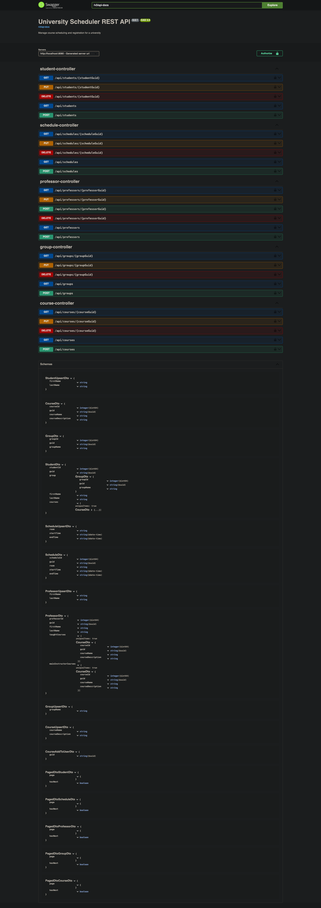

# University Scheduler REST API

## Overview

The University Scheduler REST API is designed to manage course scheduling, registration, and timetables for a
university. The system will support creating, modifying, and deleting courses, registering students and professors, and
generating timetables.

## Features

- **Course Management**: Create, modify, and delete courses.
- **Registration**: Register students and professors to the system.
- **Course Enrollment**: Enroll students in courses and associate professors with courses.
- **Timetable Generation**: Generate and retrieve timetables for students and professors by day or month.
- **Search Functionality**: Search for courses, students, and professors.

## Technologies

- Java
- Spring Boot
- Spring Data JPA
- Spring Security
- Spring AOP
- Springdoc for OpenAPI Documentation
- Maven
- Lombok
- Flyway
- PostgreSQL
- MapStruct
- Logback
- JUnit
- Testcontainers
- Mockito


## To run the application
The API has 2 profiles implemented: `dev` (more verbose logging) and `test` (less verbose logging).
Toggling the profiles can be done by setting the `APP_PROFILE` environment variable (`dev` is the default).

### On Linux/MacOS

- To use your own Postgres instance: Modify the `jdbc-url`, `username` and `password` settings in 
`src/main/resources/application.yml` with your connection details and then run the following command from 
the repo root directory -
```shell
./mvnw spring-boot:run
```

Logs are sent both to the console and to a file (more verbose).
The log file will be called `school-scheduler_$APP_PROFILE.log` and stored in the repo root.

- Using Docker: Modify the environment variables in `src/main/resources/.env_example` as needed (or leave it as-is), 
then rename `.env_example` to `.env` and run following commands from the repo root directory (to build the app 
and start its containers):
```shell
./mvnw package -DskipTests && docker-compose up -d
```

Logs are sent both to the console (can be viewed with `docker logs "$APP_CONTAINER"`) and to a file (more verbose).
The log file will be called `school-scheduler_$APP_PROFILE_docker.log` and stored in the repo root.

### On Windows

- To use your own Postgres instance: Modify the `jdbc-url`, `username` and `password` settings in 
`src/main/resources/application.yml` with your connection details and then run the following command from 
the repo root directory -
```shell
./mvnw.cmd spring-boot:run
```

- Using Docker: Modify the environment variables in `src/main/resources/.env_example` as needed (or leave it as-is),
  then rename `.env_example` to `.env` and run following commands from the repo root directory in a CMD terminal 
(to build the app and start its containers):
```shell
./mvnw.cmd package -DskipTests && docker-compose up -d
```

## Usage

- Access the Swagger UI at `http://localhost:8080/swagger-ui/index.html` or
- Consume the REST API endpoints using cURL or any other tool.

## API Endpoints

Swagger documentation:



## To run tests

Note that you probably will need to run your Docker daemon with admin privileges since the tests use Testcontainers 
to issue commands directly to the daemon and have it dynamically spin up containers 
(the `/var/run/docker.sock` Docker Unix socket file is used to this effect).

### On Linux/MacOS
```shell
./mvnw test
```

### On Windows
```shell
./mvnw.cmd test
```

Testing results are sent both to the console and to a file (more verbose).
The log file will be called `school-scheduler_tests.log` and stored in the repo root.